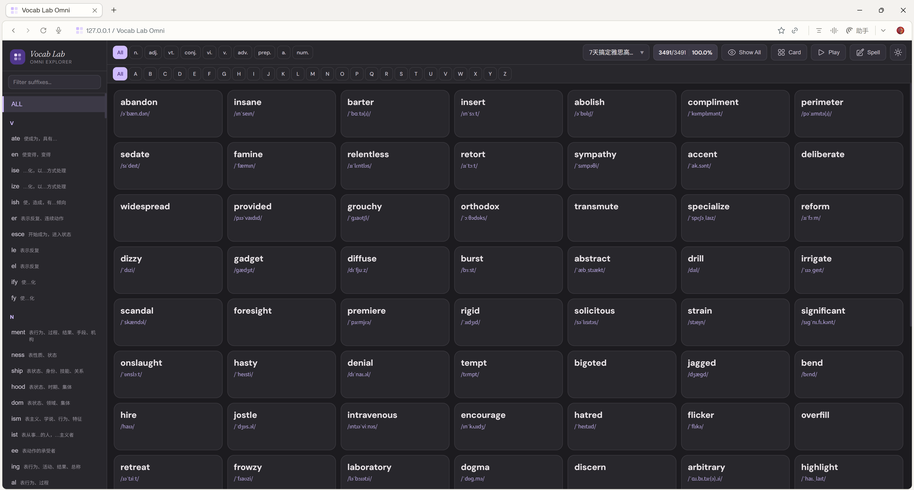

# Vocab Lab Omni

一个功能丰富的英语单词学习工具，支持 56+ 词库浏览、自动播放、拼写测试和多源例句系统。

> 🔗 **在线体验**：[https://julie1m1.github.io/english-word-suffix-explorer](https://julie1m1.github.io/english-word-suffix-explorer)

## 截图预览

<!-- 添加截图：将图片放入 assets/ 文件夹，取消注释下方行 -->

<!--  -->
<!--  -->
<!--  -->

 

---

## 功能特性

### 词库浏览
- **56+ 词库**：雅思、托福、GRE、朗文、牛津、Wordly Wise 等全覆盖
- **分类管理**：按考试类型分组，支持禁用横线分隔
- **后缀/前缀过滤**：快速定位同类单词（如 `-tion`, `-ment`, `un-`）
- **A-Z 字母索引**：点击字母跳转到对应单词
- **词性筛选**：名词、动词、形容词等一键过滤
- **卡片/列表视图**：切换两种浏览模式
- **分页懒加载**：自动加载更多，支持大量词库

### 单词书选择
- 独立选书页面（`book-select.html`）
- 按分类展示所有单词书
- 支持搜索过滤
- 记住上次选择的词库（localStorage）

### 自动播放（Auto Play）
- 自动朗读当前筛选的单词列表
- 可调语速：0.75x / 1x / 1.25x / 1.5x / 2x
- 可调间隔：0s / 1s / 2s / 3s / 5s
- 重复播放：1x / 2x / 3x / 5x
- **隐藏单词模式**：听音辨词，点击临时翻牌
- 点击任意卡片跳转播放位置
- 键盘控制：`空格` 暂停/继续，`←` 上一个，`→` 下一个

### 拼写测试（Spelling Mode）
- 听音拼写练习，从任意单词开始
- 自动判断正误（输满字母自动提交）
- 逐字对比高亮（正确/错误/缺失）
- 显示/隐藏单词辅助
- 统计面板：正确率、错误数、跳过数
- 支持重试错误单词
- 快捷键：`Enter` 提交/下一个，`空格` 重听

### 例句系统
- **四源合并**：AI 生成 + Free Dictionary API + Tatoeba2 + ECDICT
- **来源标记**：
  - 口语（粉色）— AI 生成的口语化例句
  - 书面（紫色）— AI 生成的书面语例句
  - ECD（绿色）— ECDICT 词典例句
  - Tat（蓝色）— Tatoeba2 社区例句
  - API（黄色）— Free Dictionary API 例句
- **单词高亮**：例句中的目标词自动高亮
- **Show All 控制**：一键展开/折叠所有例句
- **骨架屏加载**：API 请求中显示动画占位

### 音标系统
- 自动加载 IPA 音标（dictionaryapi.dev）
- localStorage 缓存（最多 5000 词）
- IntersectionObserver 视口懒加载
- 异步补充 Tatoeba2 例句

### 主题
- Material Design 3 设计语言
- 暗色/亮色一键切换
- 记住用户偏好

### 移动端适配
- 响应式布局（≤1024px 自动切换）
- 底部后缀导航栏（可滑动）
- 滚动时自动隐藏/显示顶栏
- 拼写模式下隐藏字典链接

---

## 文件结构

```
├── index.html                # 主页面
├── book-select.html          # 单词书选择页面
├── script.js                 # 核心逻辑（词库加载、播放、拼写、例句）
├── style.css                 # 样式表（Material Design 3）
├── package.json              # 项目配置
├── data/
│   ├── list.json             # 词库列表 + 分类配置
│   ├── examples.json         # AI 生成例句（口语/书面）
│   ├── ecdict-examples.json  # ECDICT 提取例句
│   ├── longman3000_missing.json    # 朗文 3000 补充数据
│   ├── longman3000_new_examples.json # 朗文 3000 新例句
│   ├── Suffix_Ref.csv        # 后缀/前缀参考数据
│   └── *.csv                 # 56 个词库 CSV 文件
└── scripts/                  # 数据处理脚本（开发用）
```

---

## 数据来源

| 分类 | 词库数 | 包含词库 |
|------|--------|----------|
| 雅思 | 9 | 7天高频核心词、100句7000词、剑桥精典、词组必备等 |
| 托福/SAT/GMAT/GRE | 8 | 托福词组、SAT巴朗、GMAT精选、GRE巴朗等 |
| 考研/PET/KET | 4 | 考研2025、考研写作、PET巧记、KET核心词 |
| BEC | 2 | 中级/高级词汇精选 |
| 通用词组 | 2 | 英语词组全书（上/下） |
| 牛津/Wordly Wise | 16 | Oxford 3000/5000、Wordly Wise Book 1-10/K |
| 朗文/语料库 | 8 | 朗文3000、Side by Side 1-4、美国语料库 |
| 竞赛/热词 | 4 | 大英竞赛8000、热词红宝书 1-3 版 |
| 其他 | 3 | 鸭圈雅思、学术词汇、ACT核心词 |

**总计**：56 词库，50,000+ 单词

 
---

## 技术栈

| 技术 | 用途 |
|------|------|
| HTML/CSS/JS | 纯前端，零框架依赖 |
| Material Design 3 | 设计语言与配色 |
| dictionaryapi.dev | IPA 音标 + API 例句 |
| Tatoeba2 | 社区多语言例句 |
| ECDICT | 本地词典例句数据 |
| IntersectionObserver | 音标/分页懒加载 |
| localStorage | 音标缓存 + 用户偏好 |
| Web Audio API | 单词发音（有道词典） |

---

## 键盘快捷键

| 模式 | 按键 | 功能 |
|------|------|------|
| 播放模式 | `空格` | 暂停/继续 |
| 播放模式 | `←` | 上一个单词 |
| 播放模式 | `→` | 下一个单词 |
| 拼写模式 | `Enter` | 提交答案 / 下一个 |
| 拼写模式 | `空格` | 重听发音 |

---

## 贡献

欢迎提交 Issue 和 Pull Request！

 

 
